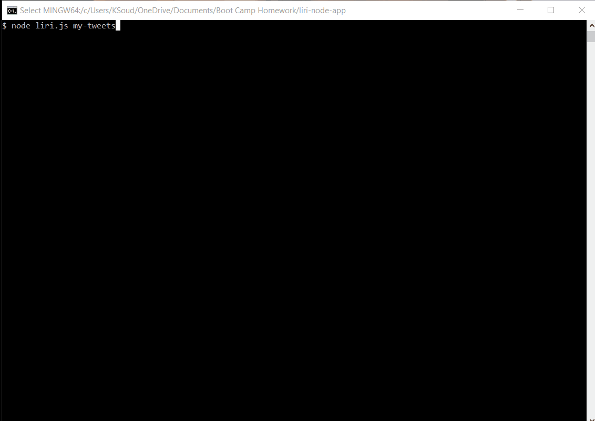

# liri-node-app
Week 10 Homework - UCF Coding Bootcamp 
Have liri take in the following commands: 
    1.	node liri.js my-tweets 
        a.	This will show your last 20 tweets and when they were created at in your terminal/bash window. 
    2.	node liri.js spotify-this-song '<song name here>' 
        a.	This will display artist, song name, album, and preview link  
        b.	Default to “Ace of Base”  
    3.	node liri.js movie-this '<movie name here>'  
        a.	 Title of the movie.  
        b.	Year the movie came out.  
        c.	IMDB Rating of the movie.  
        d.	Rotten Tomatoes Rating of the movie.  
        e.	Country where the movie was produced.  
        f.	Language of the movie.  
        g.	Plot of the movie.  
        h.	Actors in the movie.  
        i.	If the user doesn't type a movie in, the program will output data for the movie 'Mr. Nobody.  
    4.	node liri.js do-what-it-says 
        a.	Using the fs Node package, LIRI will take the text inside of random.txt and then use it to call one of LIRI's commands. 
        b.	It should run spotify-this-song for "I Want it That Way," as follows the text in random.txt.  

